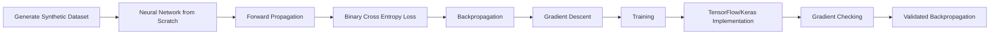
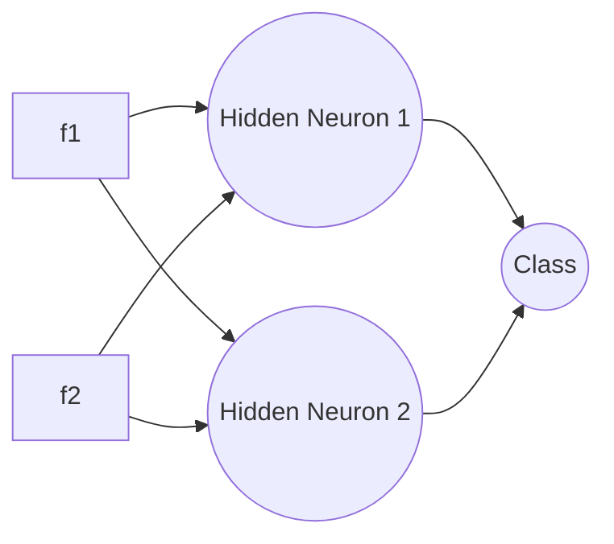
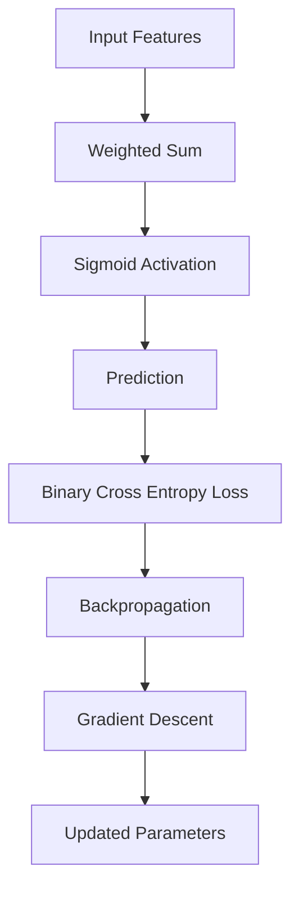

# Neural Network from Scratch for Binary Classification

A complete implementation of a feedforward neural network for binary classification using only **NumPy**, followed by an equivalent implementation using **TensorFlow/Keras** to verify the correctness of the manually implemented forward propagation, backpropagation, and optimization process.

The repository demonstrates every mathematical operation involved in training a neural network—from weight initialization to gradient computation—without relying on any deep learning framework for the primary implementation.

The project concludes with **Gradient Checking**, where the manually derived gradients are compared against TensorFlow's automatic differentiation (`GradientTape`) to validate the implementation.

---

# Project Workflow



---

# Project Overview

This project was built to understand **how neural networks actually learn**, rather than treating deep learning frameworks as black boxes.

Instead of using a single function such as `model.fit()`, every stage of the learning process has been implemented manually using **NumPy**, including:

- Weight Initialization
- Bias Initialization
- Forward Propagation
- Sigmoid Activation
- Binary Cross Entropy (BCE) Loss
- Backpropagation
- Gradient Descent Parameter Updates

After completing the manual implementation, the same neural network architecture is recreated using **TensorFlow/Keras**.

The gradients produced by TensorFlow's automatic differentiation engine (`GradientTape`) are then compared against the manually derived gradients. Matching gradients confirm that the implemented backpropagation algorithm is mathematically correct.

This repository is designed for anyone who wants to understand the mathematics behind neural networks rather than simply using existing deep learning libraries.

---

# Repository Structure

```text
Classification_Problems/

│── model-from-scratch.ipynb
│     Complete implementation using NumPy

│── model-with-libraries.ipynb
│     Equivalent implementation using TensorFlow/Keras

│── Gradient-Check.ipynb
│     Manual gradients vs TensorFlow GradientTape

│── README.md
```

---

# Features

- Neural Network implemented entirely from scratch using NumPy
- Manual Forward Propagation
- Manual Binary Cross Entropy Loss
- Manual Backpropagation
- Manual Gradient Descent
- TensorFlow/Keras implementation for verification
- Gradient Checking using TensorFlow GradientTape
- Synthetic binary classification dataset
- Standardized input features
- Fully documented mathematical derivations

---

# Neural Network Architecture

The network implemented throughout this project is a fully connected feedforward neural network consisting of:

- **Input Layer:** 2 Features (`f1`, `f2`)
- **Hidden Layer:** 2 Neurons (Sigmoid Activation)
- **Output Layer:** 1 Neuron (Sigmoid Activation)

The output neuron predicts the probability of belonging to the positive class.



---

### Input Features

| Feature | Description |
|----------|-------------|
| **f1** | Input Feature 1 |
| **f2** | Input Feature 2 |

---

### Output

| Output | Description |
|---------|-------------|
| **Class** | Binary prediction (0 or 1) |

The network receives two numerical input features (`f1` and `f2`) and predicts the probability that the sample belongs to the positive class.

During inference,

- Probability ≥ 0.5 → Class = **1**
- Probability < 0.5 → Class = **0**

---

## Learning Pipeline

The complete learning pipeline implemented in this repository is illustrated below.



Every block shown above has been implemented manually in the NumPy version before being verified using TensorFlow.
