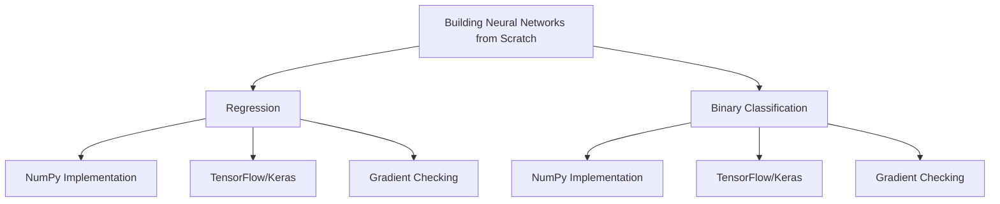
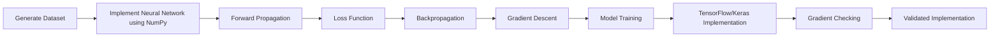

# Building Neural Networks from Scratch

A collection of projects focused on understanding **how neural networks learn from first principles**.

Instead of relying on high-level deep learning frameworks, every project in this repository implements the complete learning pipeline manually using **NumPy**, including forward propagation, loss computation, backpropagation, and gradient descent.

Each implementation is then recreated using **TensorFlow/Keras** and verified through **Gradient Checking** using TensorFlow's automatic differentiation (`GradientTape`).

The objective of this repository is not to build production-ready models, but to develop a deep understanding of the mathematics and algorithms that power modern neural networks.

---

# Repository Roadmap



---

# Repository Structure

```text
Building-Neural-Networks-from-Scratch/

│── Regression/
│     │── model-from-scratch.ipynb
│     │── model-with-libraries.ipynb
│     │── Gradient-Check.ipynb
│     └── README.md

│── Classification/
│     │── model-from-scratch.ipynb
│     │── model-with-libraries.ipynb
│     │── Gradient-Check.ipynb
│     └── README.md

└── README.md
```

---

# Learning Workflow

Every project in this repository follows the same implementation pipeline.



---

# Project Highlights

Each project in this repository includes:

-  Complete neural network implementation using **NumPy**
-  Manual forward propagation
-  Manual loss computation
-  Manual backpropagation
-  Manual gradient descent
-  Equivalent implementation using **TensorFlow/Keras**
-  Gradient verification using **TensorFlow GradientTape**
-  Detailed documentation with mathematical derivations
-  Well-commented code for educational purposes

---

# Repository Components

| Project | Description |
|----------|-------------|
| **Regression** | Implements a feedforward neural network for continuous value prediction using **Mean Squared Error (MSE)** loss. Includes NumPy implementation, TensorFlow implementation, and gradient checking. |
| **Binary Classification** | Implements a feedforward neural network for binary prediction using **Binary Cross Entropy (BCE)** loss. Includes NumPy implementation, TensorFlow implementation, and gradient checking. |

---

# Repository Goals

The primary goal of this repository is to bridge the gap between the mathematical theory of neural networks and their practical implementation.

Each project focuses on:

- Building neural networks without automatic differentiation
- Understanding every mathematical operation involved during training
- Deriving gradients manually using backpropagation
- Verifying manual implementations against TensorFlow
- Developing intuition before relying on deep learning frameworks

---

# Technologies Used

- Python
- NumPy
- Pandas
- Matplotlib
- Scikit-Learn
- TensorFlow / Keras

---

# Explore the Projects

| Project | Documentation |
|----------|---------------|
| Regression | [`Regression/README.md`](./Regression/README.md) |
| Binary Classification | [`Classification/README.md`](./Classification/README.md) |

Each project contains:

- Complete implementation from scratch
- Mathematical explanation
- TensorFlow implementation
- Gradient checking
- Results and observations

---

> **Note**
>
> This repository is intended for learning and educational purposes. Every implementation prioritizes clarity and mathematical understanding over framework abstraction, allowing readers to see exactly how neural networks perform forward propagation, compute loss, calculate gradients, and update parameters during training.
