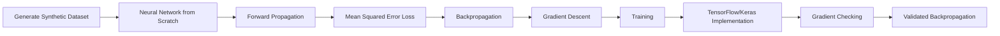
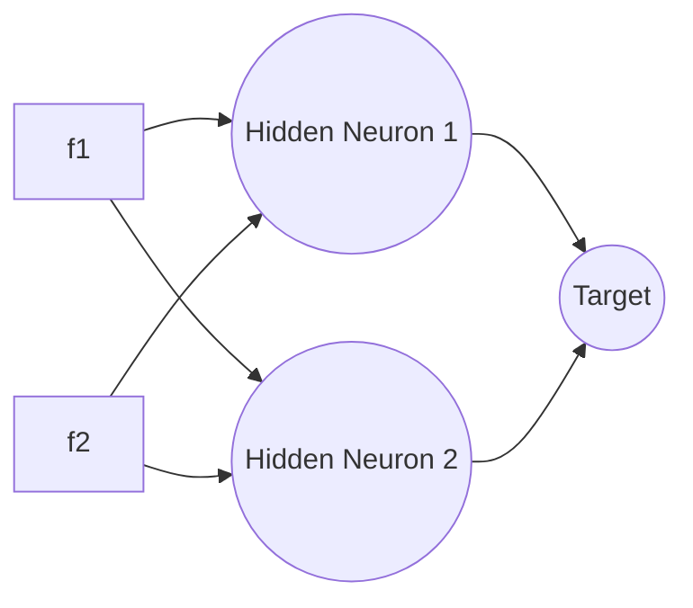
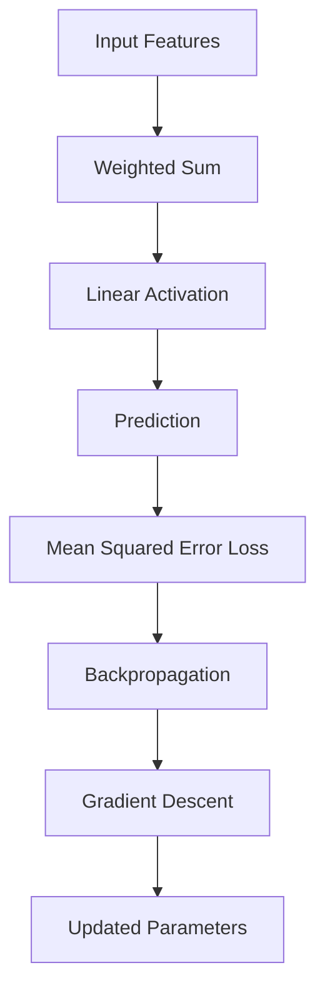

# Neural Network from Scratch for Regression

A complete implementation of a feedforward neural network for regression using only **NumPy**, followed by an equivalent implementation using **TensorFlow/Keras** to verify the correctness of the manually implemented forward propagation, backpropagation, and optimization process.

The repository demonstrates every mathematical operation involved in training a neural network—from weight initialization to gradient computation—without relying on any deep learning framework for the primary implementation.

The project concludes with **Gradient Checking**, where the manually derived gradients are compared against TensorFlow's automatic differentiation (`GradientTape`) to validate the implementation.

---

# Project Workflow



---

# Project Overview

This project was built to understand how neural networks solve **regression problems** without relying on high-level deep learning frameworks.

Every component of the learning algorithm has been implemented manually using **NumPy**, including:

- Weight Initialization
- Bias Initialization
- Forward Propagation
- Linear Output Layer
- Mean Squared Error (MSE) Loss
- Backpropagation
- Gradient Descent Parameter Updates

Once the manual implementation is completed, an identical neural network is recreated using **TensorFlow/Keras**.

Finally, TensorFlow's automatic differentiation (`GradientTape`) is used to verify that every manually computed gradient matches the framework's implementation.

This repository focuses on understanding the mathematical foundations of regression using neural networks rather than simply training a model with existing libraries.

---

# Repository Structure

```text
Regression_Problems/

│── model-from-scratch.ipynb
│     Complete implementation using NumPy

│── model-with-libraries.ipynb
│     Equivalent implementation using TensorFlow/Keras

│── Gradient-Check.ipynb
│     Manual gradients vs TensorFlow GradientTape

│── README.md
```

---

# Features

- Neural Network implemented entirely from scratch using NumPy
- Manual Forward Propagation
- Manual Mean Squared Error (MSE) Loss
- Manual Backpropagation
- Manual Gradient Descent
- TensorFlow/Keras implementation for verification
- Gradient Checking using TensorFlow GradientTape
- Synthetic regression dataset
- Standardized input features
- Fully documented mathematical derivations

---

# Neural Network Architecture

The network implemented throughout this project is a fully connected feedforward neural network consisting of:

- **Input Layer:** 2 Features (`f1`, `f2`)
- **Hidden Layer:** 2 Neurons (Linear Activation)
- **Output Layer:** 1 Neuron (Linear Activation)

Unlike classification, the output layer does **not** use a sigmoid activation because the objective is to predict a continuous numerical value rather than a probability.



---

### Input Features

| Feature | Description |
|----------|-------------|
| **f1** | Input Feature 1 |
| **f2** | Input Feature 2 |

---

### Output

| Output | Description |
|---------|-------------|
| **Target** | Continuous numerical value |

The neural network receives two numerical input features (`f1` and `f2`) and predicts a continuous target value.

Unlike classification models, there is no decision threshold because the output is a real-valued prediction.

---

## Learning Pipeline



Every block shown above has been implemented manually in the NumPy version before being verified using TensorFlow.
